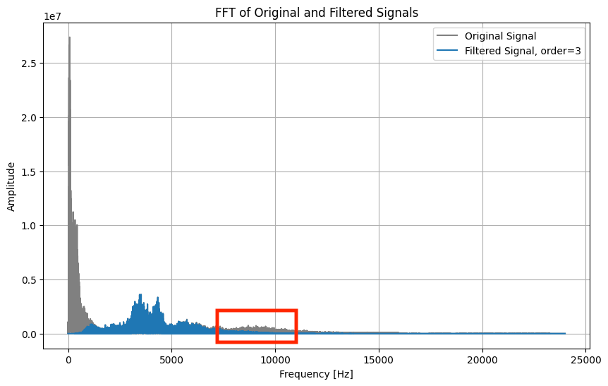
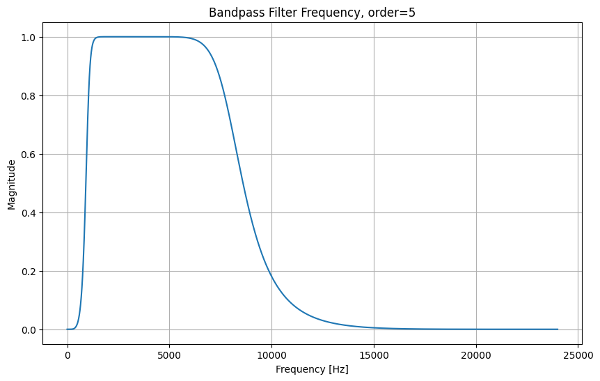

# Audio Signal Processing for Bird Sound Isolation

## Objective:

The goal of this project is to analyze an audio recording to identify and isolate the sounds of birds and a plane. This involves plotting time and frequency representations of the signal, applying filtering techniques to isolate the bird sounds, and removing the bird sounds to isolate the plane sounds.

## Analysis and Discussion:

For this assignment, I applied two filters with 3 orders to filter bird and plane sounds from the original audio.
 
### 🕊️ Bird sound: 

The filter used here is bandpass. It will remain the audio between the lowcut and upcut which means it will extract the signal within the frequency range of 1kHz to 8kHz.

The different order of filters shows a different steepness of the curve around the cutoff frequencies, as the following graphs:

* order = 3

 
 
  
* order = 5

  
* order = 7

 
 
  

### ✈️ Plane sound: 

* order = 3

 
 
  
* order = 5

  
* order = 7

 
 

From the following analysis there are two observations to make:
1. when the order increasing, the sharper curve is around the cutoff area
2. When the order increasing, the shape of the audio waveform is far away from the orginal one, since it is hard to find directly, you need to play the results under img folder.

This obversions are reasonable, because high orders are better at preserving the high-frequency content that gives the square wave its sharp edges.

## Discussion

There are some anomalies I noticed but I am not sure why it happens:
1. The bandpass filter changes the shape of the original image, more specifaclly, it enlarges the second peak
2. Both filters didn't play their roles well. For the bandpass, it still keeps the area (F > 8000) and for the bandstop, it still keeps the are (2000<F<8000)
3. According the final audios filtered by different orders, I didn't see any difference and the filtering doesn't extract neither the bird nor plane sound cleanly. Noise still remains.
