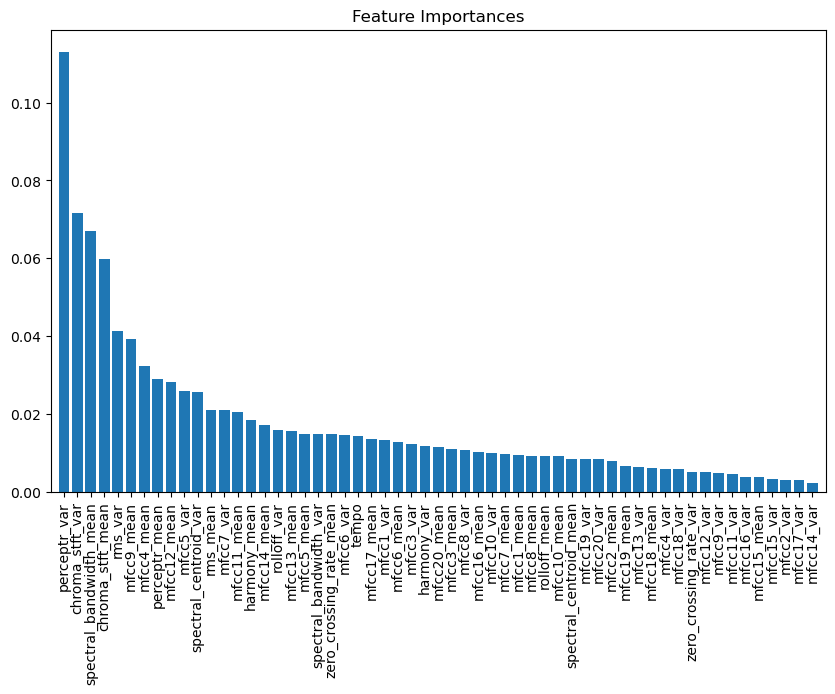

# Audio Classification Using Machine Learning

## Objective

The objective of this assignment is to develop and evaluate different machine learning classifiers for the task of audio classification. You will use a dataset that contains audio features to classify audio samples into various genres.

## Data Preprocessing

* EDA
* Drop useless columns ("filename", "length") 
* Data visulization of decomposition
* Data normalization
* Train/Test split

## Model building

* KNN
* Random Forest
* SVM
* Gradient Boosting
* MLP

## Evaluation

### KNN
* Confusion Matrix: 
```
 [[11  0  3  0  0  0  1  0  1  4]
 [ 0 11  0  0  0  2  0  0  0  0]
 [ 1  1 21  0  1  1  0  0  1  1]
 [ 2  0  2 14  1  0  1  1  0  0]
 [ 0  0  0  1  9  0  0  3  2  0]
 [ 0  1  3  1  0 15  0  1  0  1]
 [ 0  0  0  3  0  0 21  0  0  1]
 [ 1  0  0  1  0  1  0  9  1  0]
 [ 1  0  2  3  5  0  1  1 10  0]
 [ 3  1  4  1  0  0  0  1  1 10]]
 ```
* Classification Report: 


### Random Forest
* Confusion Matrix: 
```
 [[15  0  0  0  0  1  3  0  0  1]
 [ 0 13  0  0  0  0  0  0  0  0]
 [ 5  0 15  1  0  1  1  0  2  2]
 [ 0  0  0 12  5  0  2  0  1  1]
 [ 0  0  0  1 10  0  0  2  2  0]
 [ 0  0  0  0  0 20  0  1  0  1]
 [ 1  0  0  1  0  0 23  0  0  0]
 [ 1  0  0  0  2  0  0  8  1  1]
 [ 1  0  4  3  5  0  0  0  7  3]
 [ 0  0  2  4  1  2  2  0  1  9]]
 ```

* Classification Report:


* Feature Importance
  


### SVM
* Confusion Matrix: 
```
 [[16  0  0  0  0  1  0  0  1  2]
 [ 0 12  0  0  0  1  0  0  0  0]
 [ 5  0 18  0  0  0  0  0  0  4]
 [ 1  0  1 14  2  0  0  1  1  1]
 [ 0  0  0  0 12  0  0  1  2  0]
 [ 3  0  2  1  0 15  0  0  0  1]
 [ 0  0  0  0  2  0 22  0  0  1]
 [ 0  0  0  0  0  0  0 11  2  0]
 [ 3  0  1  4  2  0  1  1 10  1]
 [ 2  0  3  1  2  0  1  0  2 10]]
```

* Classification Report:
  


### Gradient Boosting

* Confusion Matrix: 
```
 [[15  0  2  0  0  0  2  0  0  1]
 [ 0 13  0  0  0  0  0  0  0  0]
 [ 4  0 15  3  1  0  0  0  3  1]
 [ 1  0  0 13  3  0  0  0  2  2]
 [ 0  0  0  1 11  0  0  0  3  0]
 [ 2  0  0  0  0 19  0  1  0  0]
 [ 2  0  0  1  0  0 22  0  0  0]
 [ 0  0  0  0  1  0  0  9  2  1]
 [ 1  0  1  3  3  0  0  1 13  1]
 [ 2  0  5  3  1  0  0  0  2  8]]
```
* Classification Report:
  


* Feature Importance
  


### ⭐️MLP⭐️
* Confusion Matrix: 
```
 [[17  0  2  0  0  0  0  0  0  1]
 [ 0 13  0  0  0  0  0  0  0  0]
 [ 4  0 18  0  0  1  1  1  0  2]
 [ 1  0  0 13  5  0  0  0  1  1]
 [ 0  0  0  0 10  0  1  0  4  0]
 [ 0  0  0  0  0 20  0  1  0  1]
 [ 0  0  0  1  0  0 23  0  0  1]
 [ 0  0  1  0  0  0  0 11  1  0]
 [ 1  0  1  2  3  0  2  1 11  2]
 [ 1  0  1  2  1  1  0  1  2 12]]
```

* Classification Report:
  


## Conclusion


The MLP is the best model no matter on accuracy, precision, recall or f1. However, none of them satisfies me. I think the reason it doesn't preform well could be:

1. The dataset is small, the benefits of ensembling might be limited.
2. The clusters of data are overlapped heavily, it can be told from the tsne analysis.
3. The data contains non-linear relationship, MLP could learn from it (Forest models could do it as well).
4. The hyperparams are not the proper ones.
5. In general, the classfications on label 8, 9 are weaker than others based on f1 score, it may suggests some features are noise for those two classes
6. The result is not convincing enough since no hyperparams searching or cross validation
